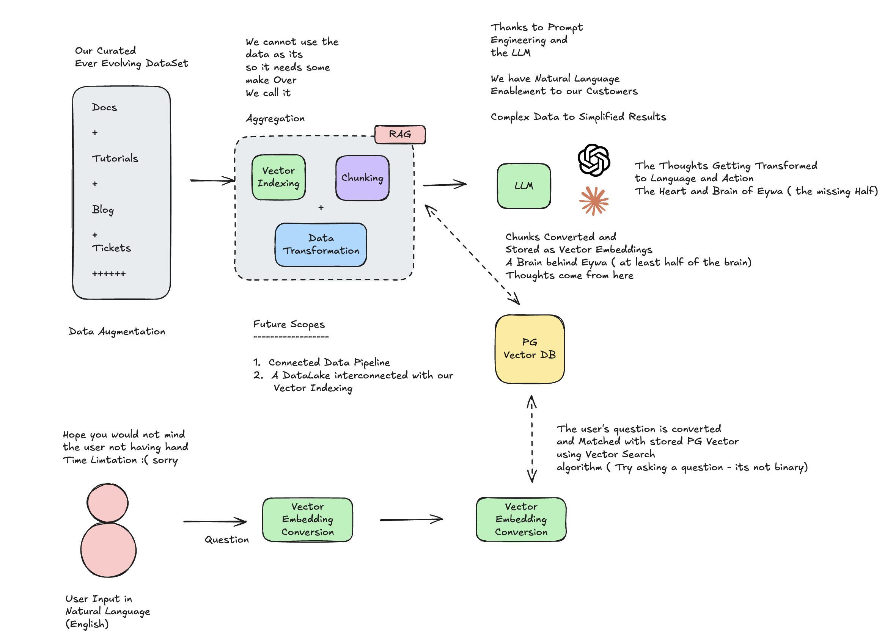

## Project: Eywa-AI Support Agent

### Problem Statement
Customers using Testsigma's product often contact the Customer Support Team for minor issues, consuming valuable time and resources. When the support team is busy, the response time to customer queries gets delayed, leading to dissatisfaction.

### Solution
Eywa-AI Support Agent provides a swift and efficient Level 1 customer support solution for Testsigma’s product. It addresses customer queries in seconds, providing immediate answers along with relevant web links for detailed information when required. This system reduces the workload of the support team, allowing them to focus on more complex issues.

### Workflow
1. **Customer Query:** Customers submit their questions through a user-friendly interface (UI).
2. **Processing:** The query is directed to a fine-tuned model trained on company-specific data.
3. **Response:** The model provides the customer with an appropriate answer, including relevant web links where necessary.

Eywa leverages the RAG (Retrieval-Augmented Generation) architecture to enhance response accuracy and relevance.

### Eywa Architecture

### Features
- Instant responses to customer queries.
- Provides relevant web links for additional information.
- Acts as a Level 1 support system to reduce dependency on the Customer Support Team.
- Fine-tuned model based on company data to ensure accurate and reliable answers.

### Future Scope
- Connected Data Pipeline
- A DataLake interconnected with our vector indexing.
